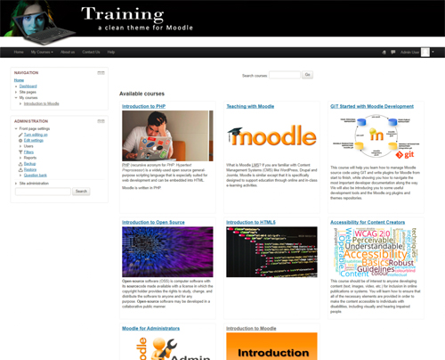

Training theme for Moodle
====================================

# Table of Contents

- [Basic Overview](#basic-overview)
- [Requirements](#requirements)
- [Download Training theme for Moodle](#download-training-theme-for-moodle)
- [Installation](#installation)
- [Usage](#usage)
- [Updating](#updating)
- [Uninstallation](#uninstallation)
- [Limitations](#limitations)
- [Language Support](#language-support)
- [Frequently Asked Questions (FAQ)](#faq)
- [Contributing](#contributing)
- [Motivation for this plugin](#motivation-for-this-plugin)
- [Further information](#further-information)
- [License](#license)

# Basic Overview

Training theme for Moodle is a simple and clean theme for Moodle. It includes support for:

* Large and small size logo or banner;
* Dark on light and light on dark custom menu bar;
* Display of course list in grid view;
* Customizable favicon;
* Customizable CSS;
* Support for Moodle filter tags in the custom menu;
* Accessibility improvements.

IMPORTANT: Although we expect everything to work, this ALPHA release has not been fully tested in every situation. If you find a problem, please help by reporting it in the [Bug Tracker](http://github.com/michael-milette/moodle-theme_training/issues).

[(Back to top)](#table-of-contents)

# Requirements

This plugin requires Moodle 3.1+ from http://moodle.org/

[(Back to top)](#table-of-contents)

# Download Training theme for Moodle

The most recent DEVELOPMENT release can be found at:
https://github.com/michael-milette/moodle-theme_training

[(Back to top)](#table-of-contents)

# Installation

Install the plugin, like any other plugin, to the following folder:

    /theme/training

See https://docs.moodle.org/34/en/Installing_a_new_theme for details on installing Moodle plugins.

In order for the themes to work, it must be installed and activated.

To activate, go to Site Administration > Appearance > Themes > Theme selector. Click **Change theme** next to the **Default** section. Select the Training theme and click **Save**.

[(Back to top)](#table-of-contents)

# Usage

IMPORANT: Although we expect everything to work, this ALPHA release has not been fully tested in every situation. If you find a problem, please help by reporting it in the [Bug Tracker](http://github.com/michael-milette/moodle-theme_training/issues).

Configurable settings for this theme include:
* Customizable favicon;
* Large and small size logos;
* To use a banner instead of a logo;
* Place the navbar above or below the logo / banner;
* Dark on light and light on dark custom menu bar;
* Display of course list in Masonry (grid view);
* Hide site pages and links to them in the navigation block on the front page. They will re-appear when in edit mode. This enables you to create public site pages without having to enable guest user access;
* Customizable CSS.

You can configure these setting by going to Site Administration > Appearance > Themes > Training.

[(Back to top)](#table-of-contents)

# Updating

There are no special considerations required for updating the plugin.

The first public ALPHA version was released on 2017-11-05.

For more information on releases since then, see
[CHANGELOG.md](https://github.com/michael-milette/moodle-theme_training/blob/master/CHANGELOG.md).

[(Back to top)](#table-of-contents)

# Uninstallation

Uninstalling the plugin by going into the following:

Site Administration > Plugins > Plugins overview > Training

...and click Uninstall. You may also need to manually delete the following folder:

    /theme/training

# Language Support

This plugin includes support for the English language.

If you need a different language that is not yet supported, please feel free
to contribute using the Moodle AMOS Translation Toolkit for Moodle at

https://lang.moodle.org/

This plugin has not been tested for right-to-left (RTL) language support.
If you want to use this plugin with a RTL language and it doesn't work as-is,
feel free to prepare a pull request and submit it to the project page at:

http://github.com/michael-milette/moodle-theme_training

# FAQ

## Frequently Asked Questions

IMPORANT: Although we expect everything to work, this ALPHA release has not been fully tested in every situation. If you find a problem, please help by reporting it in the [Bug Tracker](http://github.com/michael-milette/moodle-theme_training/issues).

### Why does my course grid view look un-even?

The optimal size for course summary images when using this theme is 540 px wide by 300 px high. With that said, there really isn't any restriction on how tall you should make an image. However, for best results, be consistent in the height and width.

### Are there any security considerations?

There are no known security considerations at this time.

## Other questions

Got a burning question that is not covered here? If you can't find your answer, submit your question in the Moodle forums or open a new issue on Github at:

http://github.com/michael-milette/moodle-theme_training/issues

[(Back to top)](#table-of-contents)

# Contributing

If you are interested in helping, please take a look at our [contributing](https://github.com/michael-milette/moodle-theme_training/blob/master/CONTRIBUTING.md) guidelines for details on our code of conduct and the process for submitting pull requests to us.

## Contributors

Michael Milette - Author and Lead Developer

## Pending Features

Some of the features we are considering for future releases include:

* Fix the configurable favicon (known issue - currently only works in courses).
* Ability to add a background image.
* Ability to specify the name of the site as text (currently needs to be part of the logo).
* More accessibility improvements.

If you could use any of these features, or have other requirements, consider contributing or hiring us to accelerate development.

[(Back to top)](#table-of-contents)

# Motivation for this plugin

The development of this plugin was motivated through our own experience in Moodle development and topics discussed in the Moodle forums and projects we deliver to our customers. The project is sponsored and supported by TNG Consulting Inc.

[(Back to top)](#table-of-contents)

# Further Information

For further information regarding the theme_training plugin, support or to
report a bug, please visit the project page at:

http://github.com/michael-milette/moodle-theme_training

[(Back to top)](#table-of-contents)

# License

Copyright © 2017 TNG Consulting Inc. - http://www.tngconsulting.ca/

This file is part of Training theme for Moodle - http://moodle.org/

Training theme is free software: you can redistribute it and/or modify
it under the terms of the GNU General Public License as published by
the Free Software Foundation, either version 3 of the License, or
(at your option) any later version.

Training theme is distributed in the hope that it will be useful,
but WITHOUT ANY WARRANTY; without even the implied warranty of
MERCHANTABILITY or FITNESS FOR A PARTICULAR PURPOSE.  See the
GNU General Public License for more details.

You should have received a copy of the GNU General Public License
along with Training theme.  If not, see <http://www.gnu.org/licenses/>.

[(Back to top)](#table-of-contents)
